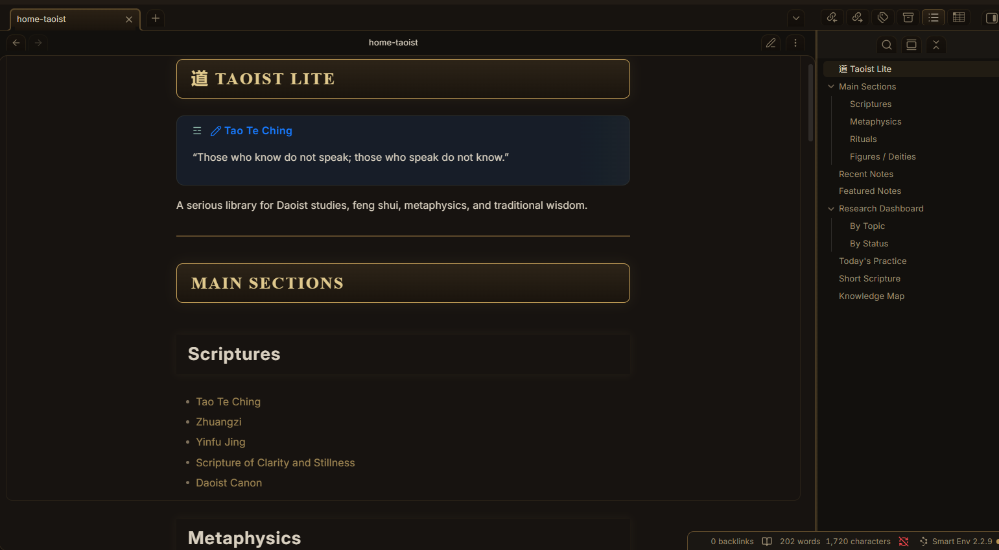
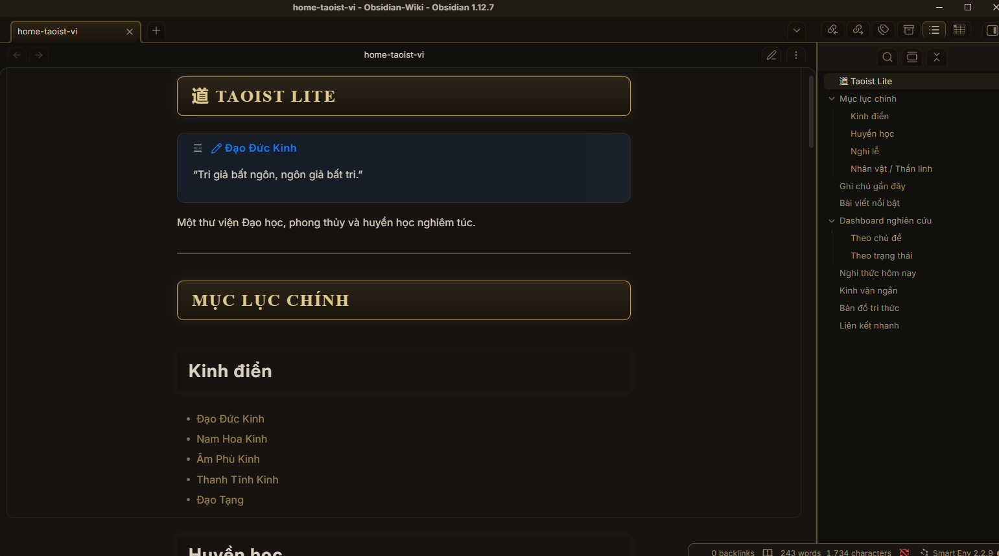

# Taoist Lite

A solemn and scholarly Obsidian theme inspired by Daoist manuscripts, ancient libraries, classical philosophy, feng shui, scripture collections, and traditional metaphysical knowledge systems.

Designed for people who study:
- Daoism
- Feng Shui
- BaZi
- Qi Men Dun Jia
- Ancient Chinese and Vietnamese philosophy
- Rituals, scriptures and spiritual research

Unlike fantasy-themed designs, Taoist Lite focuses on a serious, elegant and readable atmosphere.



---

## Features

- Dark ancient-manuscript inspired UI
- Charcoal black, antique gold, jade green and subtle vermilion palette
- Wooden-board / bamboo-slip style headings
- Ancient library inspired sidebar
- Soft paper texture and subtle ink feeling
- Special callouts:
  - `[!ritual]`
  - `[!scripture]`
  - `[!warning]`
- Gold and jade Graph View colors
- Works beautifully for both English and Vietnamese notes
- Includes a ready-made homepage dashboard: `home-taoist.md`

---

## Theme Identity

| Theme | Feeling | Main Colors |
|-------|-------|-------|
| Second Brain Lite | Modern productivity | Blue, white |
| Tarot Pro Lite | Soft, mystical, feminine | Purple, silver |
| Taoist Lite | Ancient, scholarly, solemn | Black, gold, jade |

> Taoist Lite is not fantasy.
> It is designed to feel like an ancient Daoist library combined with a modern dark research interface.

---

## Screenshots

### English


### Vietnamese



---

## Included Files

```text
manifest.json
theme.css
home-taoist.md
README.md
sceenshort-en.png
sceenshort-vi.png
````

---

## Recommended Setup

For the best experience:

* Use Dark Mode
* Install the Dataview plugin
* Pin `home-taoist.md` as your homepage
* Enable Graph View
* Use a serif font for headings if your system supports it

Recommended fonts:

* Cormorant Garamond
* Noto Serif SC
* STKaiti
* Noto Sans

---

## Custom Callouts

### Ritual

```md
> [!ritual] Ritual
> Light 3 sticks of incense and sit quietly.
```

### Scripture

```md
> [!scripture] Tao Te Ching
> Those who know do not speak.
```

### Warning

```md
> [!warning] Important
> Do not place the altar facing the bathroom.
```

## Home Dashboard

The included `home-taoist.md` file provides:

* Main knowledge sections
* Recent notes
* Featured notes
* Dataview-powered research dashboard
* Tags and categories
* English and Vietnamese versions

To use it:

1. Copy `home-taoist.md` into your vault
2. Open the file
3. Pin it or set it as your startup note

---

## Installation

### Manual Installation

1. Download the repository
2. Copy the folder into:

```text
.obsidian/themes/TaoistLite/
```

3. Make sure the folder contains:

```text
manifest.json
theme.css
```

4. Open Obsidian
5. Go to:

`Settings → Appearance → Themes`

6. Select **Taoist Lite**

---

## Repository

GitHub:
[https://github.com/MeridianOSdev/obsidian-taoist-lite](https://github.com/MeridianOSdev/obsidian-taoist-lite)

Author:
[https://MeridianOS.dev](https://MeridianOS.dev)

---

## License

MIT License

Copyright (c) 2026 MeridianOSdev
